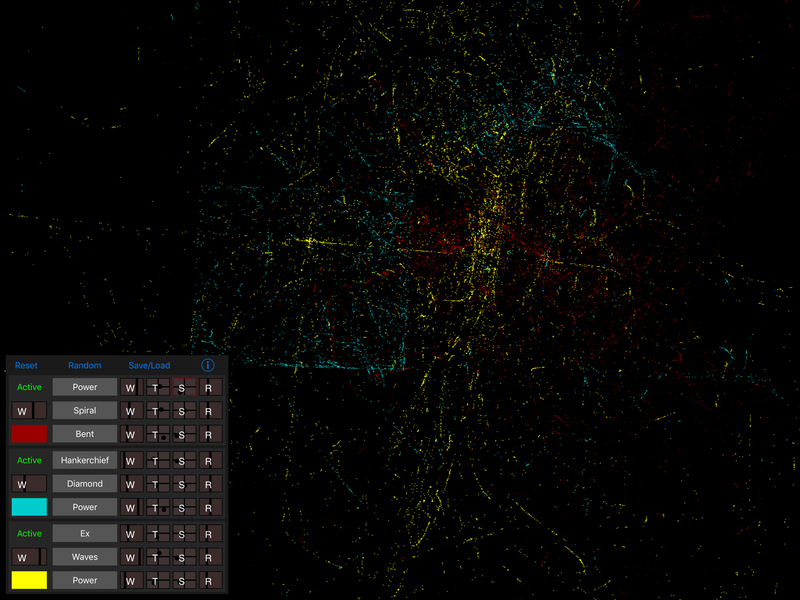

# Flam3_iPad
Flam3 IFS System for iPad using Swift and Metal

I have done IFS apps in the past, but never quite like this.
What makes Flam3 special is it's collection of algorithms.

Please visit:
http://flam3.com/
https://github.com/tariqksoliman/Fractal-Inferno

IFS = Iterated Function System.
1 Start with a blank screen, and a single randommly positioned point.
2 Randommly select one of the functions,
  and run the point's coordinates through it.
  The result becomes the new point position.
3 Draw that point on the screen.
4 goto back to step 2 thousands of times..

